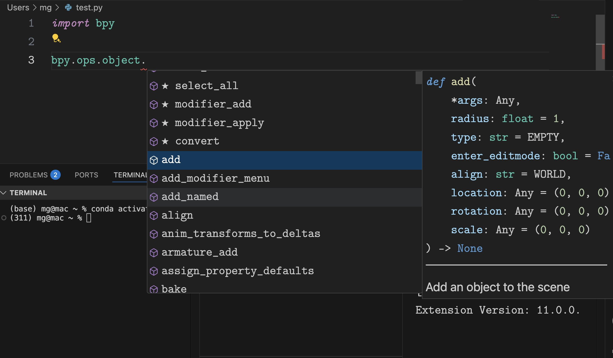

# buildbpy

A comprehensive builder for Blender's bpy module that supports all minor versions with CUDA GPU acceleration (for Linux and Windows), Apple Silicon GPU acceleration, and IDE autocomplete functionality.



---

## Features

- Builds bpy module for all minor versions and git commits of the Blender source code
- Includes CUDA GPU acceleration support
- Provides IDE autocomplete functionality
- Automated builds via GitHub Actions
- Supports multiple platforms (Windows, macOS, Linux)

## Installation

Install the bpy module using pip:

```bash
pip install --extra-index-url https://michaelgold.github.io/buildbpy/ bpy==4.5.2
```

Replace `4.5.2` with your desired Blender version.

## CLI Usage

While the builder runs automatically in CI/CD to create releases, you can also use it locally as a command-line tool:

```bash
python -m src.buildbpy.main [OPTIONS]
```

Key options:
- `--tag TEXT`: Build from a specific Blender version tag (e.g., "v4.5.2")
- `--commit TEXT`: Build from a specific Blender git commit
- `--latest-daily`: Build from the latest daily build
- `--publish`: Publish the built package (note that you must have write accesst to the repo for this to work)
- `--install`: Install the package after building
- `--clear-cache`: Clear the build cache
- `--clear-lib`: Clear the library directory

Example:
```bash
# Build from specific version tag
python -m src.buildbpy.main --tag v4.5.2

# Build from latest daily
python -m src.buildbpy.main --latest-daily
```

## Differences from Official Blender PyPi

Unlike the official Blender bpy builds, this project's releases:
1. Includes CUDA GPU acceleration support out of the box (for Windows and Linux)
2. Provides enhanced IDE support with autocomplete functionality

## Platform Support

- Windows
- macOS (Intel and Apple Silicon)
- Linux

## Contributing

Contributions are welcome! Please feel free to submit a Pull Request.

## License

This project is licensed under the same terms as Blender itself - GNU General Public License (GPL). 
