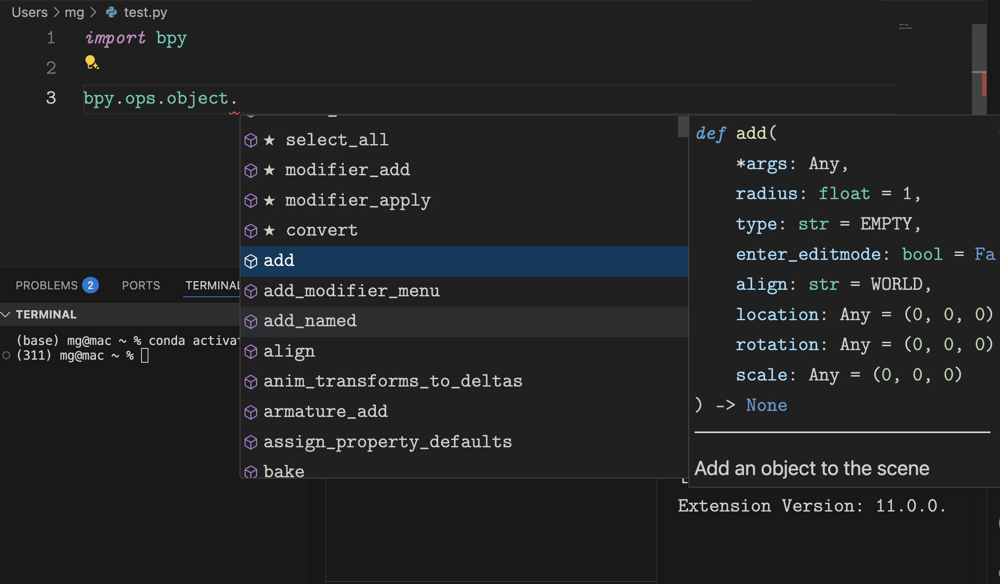

# buildbpy

A comprehensive builder for Blender's bpy module that supports all minor versions with CUDA GPU acceleration (for Linux and Windows), Apple Silicon GPU acceleration, and IDE autocomplete functionality.



---

## Features

- Builds bpy module for all minor versions and git commits of the Blender source code
- Includes CUDA GPU acceleration support
- Provides IDE autocomplete functionality
- Automated builds via GitHub Actions
- Supports multiple platforms (Windows, macOS, Linux)

## Installation

Install the bpy module using pip:

```bash
pip install --extra-index-url https://michaelgold.github.io/buildbpy/ bpy==4.5.2
```

Replace `4.5.2` with your desired Blender version.

## Linux CUDA kernels

Linux x86_64 and native ARM64 builds use CUDA Toolkit 13.0 and explicitly
build and bundle Cycles CUDA binaries. The target list is `sm_75`, `sm_80`,
`sm_86`, `sm_89`, `sm_90`, `sm_100`, `sm_120`, plus `compute_120` PTX for
forward compatibility. CUDA 13 no longer compiles Maxwell, Pascal or Volta
(targets below compute capability 7.5); these wheels do not promise support
for those GPUs. Use a CUDA-12-based build for older hardware. A sufficiently
recent NVIDIA driver is required; a CUDA toolkit is not intended to be a
runtime prerequisite when a compatible packaged kernel is available.

For local builds, put `/usr/local/cuda-13.0/bin` first on `PATH` and set
`CUDA_HOME` and `CUDA_PATH` to `/usr/local/cuda-13.0`. The ARM64 workflow uses
the native NVIDIA SBSA repository, not x86_64 packages or emulation.

After upstream `make_bpy_wheel.py` recursively packages the `bpy` resource
tree, buildbpy checks the **final wheel archive** for every configured kernel
under `bpy/.../cycles/lib`, including `.cubin.zst` and `.ptx.zst`. Missing or
empty kernels abort before installation or publication. This is a content
check, not a GPU execution test or a claim that arbitrary older Blender
sources compile with CUDA 13.

Before releasing, build and install the exact wheel in a validation venv,
check import/version and architecture tags, and render with Cycles on a real
CUDA GPU with CPU devices disabled. Preserve the native Spark ARM64 gate:
complete the native build → wheel → install/import → GPU render chain before
dispatching ARM64 CI. Hosted workflow import/content checks do not replace
that gate. Do not use publication-enabled workflows just to test a branch.

## CLI Usage

While the builder runs automatically in CI/CD to create releases, you can also use it locally as a command-line tool:

```bash
python -m src.buildbpy.main [OPTIONS]
```

Key options:
- `--tag TEXT`: Build from a specific Blender version tag (e.g., "v4.5.2")
- `--commit TEXT`: Build from a specific Blender git commit
- `--latest-daily`: Build from the latest daily build
- `--publish`: Publish the built package (note that you must have write accesst to the repo for this to work)
- `--install`: Install the package after building
- `--clear-cache`: Clear the build cache
- `--clear-lib`: Clear the library directory

Example:
```bash
# Build from specific version tag
python -m src.buildbpy.main --tag v4.5.2

# Build from latest daily
python -m src.buildbpy.main --latest-daily
```

## Differences from Official Blender PyPi

Unlike the official Blender bpy builds, this project's releases:
1. Includes CUDA GPU acceleration support out of the box (for Windows and Linux)
2. Provides enhanced IDE support with autocomplete functionality

## Platform Support

- Windows
- macOS (Intel and Apple Silicon)
- Linux

## Linux ARM64 dependency bundles

Blender 5.2 does not publish the same precompiled dependency repository for
Linux ARM64 that it publishes for Linux x86-64. On ARM64, `buildbpy` therefore:

1. looks for a checksummed bundle in the `buildbpy` GitHub Releases;
2. verifies its version/platform manifest and SHA-256 digest before extraction;
3. falls back to a complete native `make deps` build when no bundle exists.

Bundles use immutable release tags such as
`deps-blender-5.2.0-linux-arm64-v1`; published assets are never clobbered in
place. Every Blender 5.2 patch release (`5.2.x`) reuses that `5.2.0` dependency
bundle, cache key, and release identity. The manifest remains pinned to the
Blender `v5.2.0` tag commit while the generated wheel is validated against the
exact requested Blender patch version. A successful ARM64 CI build packages and
publishes a dependency tree only when the selected immutable bundle does not
already exist and only after the generated wheel installs and passes `import
bpy`.

The bundle, manifest, and checksum are trusted through GitHub HTTPS and the
repository's release-write access. SHA-256 detects corruption and mixed assets;
it is not an independent publisher signature. Downloads use finite timeouts and
atomic replacement, and unsafe archives or failed verification fall back to the
native dependency build.

For local/offline use, select an archive explicitly:

```bash
export BUILDBPY_ARM64_DEPS_ARCHIVE=/path/to/blender-5.2.0-linux-arm64-ubuntu24.04-gcc13-v1.tar.zst
export BUILDBPY_ARM64_DEPS_MANIFEST="${BUILDBPY_ARM64_DEPS_ARCHIVE}.manifest.json"
python -m buildbpy.main --tag v5.2.0 --install
```

Set `BUILDBPY_ARM64_DEPS_USE_RELEASE=0` to force native dependency compilation.
For a private fork, set `BUILDBPY_DEPS_REPOSITORY=owner/repository` and provide
`GITHUB_TOKEN` or `GH_TOKEN` with release-read access.

## Contributing

Contributions are welcome! Please feel free to submit a Pull Request.

## License

This project is licensed under the same terms as Blender itself - GNU General Public License (GPL). 
